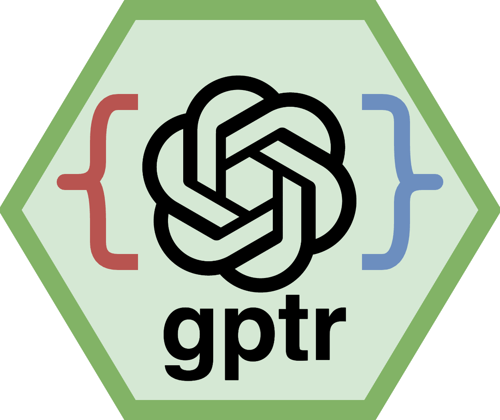

# gptr: An R Interface with the ChatGPT API <a href='https://github.com/Broccolito/gptr'></a>

Author: [Wanjun Gu](mailto:wanjun.gu@ucsf.edu)

**gptr** is an R package that provides a convenient interface with the OpenAI ChatGPT API. It allows you to interact with ChatGPT, a powerful language model, for various natural language processing tasks.

The `gptr` R package makes talking to ChatGPT in R super easy. It helps researchers and data folks by simplifying the complicated stuff, like asking questions and getting answers. With `gptr`, you can use ChatGPT in R without any hassle, making it simpler for everyone to do cool things with language!

## Installation

You can install gptr directly from CRAN:

```R
install.packages("gptr")
```

Alternatively, you can install the most recent `gptr` package from GitHub using the `devtools` package. Make sure you have `devtools` installed:

```R
install.packages("devtools")
```

Then, install `gptr`:

```R
devtools::install_github("Broccolito/gptr")
```

## Usage

### Setting up API Key

Before using the package, set your OpenAI API key using the `Sys.setenv` function:

```R
Sys.setenv(OPENAI_API_KEY = "your_openai_api_key_here")
```

For more instructions on how to get an OpenAI API key, check out this website for instructions: https://www.maisieai.com/help/how-to-get-an-openai-api-key-for-chatgpt

### Example Usage

#### Get Response

```R
library(gptr)

# Example 1
response1 <- get_response(user_input = "How to calculate the bonforoni corrected p values?")

# Example 2
response2 <- get_response(user_input = paste0("Based on this data.frame in R: \n\n",
                                               dataframe_to_text(mtcars),
                                               "\n\n which variables are correlated?"))

# Example 3
response3 <- get_response(user_input = "What are redox reactions?",
                          system_specification = "You are a knowledgeable and helpful chemist who will answer any questions in German")
```

##### Function output

```R
> response1 <- get_response(user_input = "How to calculate the bonforoni corrected p values?")

To calculate the Bonferroni corrected p-values, follow these steps:
...
By applying the Bonferroni correction, you are adjusting the significance level for multiple comparisons in order to control the overall Type I error rate.
```

```R
> response2 <- get_response(user_input = paste0("Based on this data.frame in R: \n\n",
+                                               dataframe_to_text(mtcars),
+                                               "\n\n which variables are correlated?"))

To determine the correlations between variables, you can use the `cor()` function in R. Here's an example code to calculate the correlation matrix:
...
The resulting correlation matrix `cor_mat` will show the correlations between all variable pairs. A value close to 1 indicates a strong positive correlation, a value close to -1 indicates a strong negative correlation, and a value close to 0 indicates no correlation.
```

```R
> response3 <- get_response(user_input = "What are redox reactions?",
+                           system_specification = "You are a knowledgeable and helpful chemist who will answer any questions in German")

Redox-Reaktionen (Reduktions-Oxidations-Reaktionen) sind chemische Reaktionen, bei denen ein Elektronenübergang zwischen den beteiligten chemischen Spezies stattfindet. Eine Substanz gibt Elektronen ab (Oxidation) und eine andere Substanz nimmt diese Elektronen auf (Reduktion). In einer Redox-Reaktion werden also gleichzeitig eine Oxidations- und eine Reduktionsreaktion durchgeführt. Dieser Elektronenübergang ist eng mit einem Atom- oder Ionenübergang verbunden. Das bedeutet, dass ein Element oder Ion oxidiert wird, während ein anderes Element oder Ion reduziert wird. Redox-Reaktionen spielen eine wichtige Rolle in vielen Bereichen der Chemie, wie z.B. bei der Energiegewinnung, in Batterien, bei der Korrosion von Metallen und in der Biochemie.
```

Here is the general structure of the output list:

```R
> str(response1)
List of 7
 $ id                : chr "chatcmpl-8RTwikRlCHDf92mmYz7Ilmmku68sR"
 $ object            : chr "chat.completion"
 $ created           : int 1701560660
 $ model             : chr "gpt-3.5-turbo-0613"
 $ choices           :'data.frame':	1 obs. of  3 variables:
  ..$ index        : int 0
  ..$ message      :'data.frame':	1 obs. of  2 variables:
  .. ..$ role   : chr "assistant"
  .. ..$ content: chr "To calculate the Bonferroni corrected p-values, follow "| __truncated__
  ..$ finish_reason: chr "stop"
 $ usage             :List of 3
  ..$ prompt_tokens    : int 28
  ..$ completion_tokens: int 238
  ..$ total_tokens     : int 266
 $ system_fingerprint: NULL
```

#### DataFrame to Text

```R
# Example: Convert mtcars DataFrame to text
dataframe_text <- dataframe_to_text(mtcars)
print(dataframe_text)
```

## Obtaining Your OpenAI API Key

To utilize the `gptr` package, you must first obtain an API key from OpenAI. Begin by creating an account on the OpenAI website. Post registration, navigate to the API section from the dropdown menu under your account name. Request API access by following the prompts and agreeing to the terms. After approval, retrieve your API key from the "Your API Keys" section. Securely store this key by setting it as an environment variable in your R session using the code `Sys.setenv(OPENAI_API_KEY = "your_openai_api_key_here")`. Ensure responsible handling of your API key, keeping it private and seeking assistance from OpenAI support if needed. Now, you are set to explore natural language processing with `gptr`.

## Contribution

If you encounter any issues or have suggestions for improvement, feel free to contribute by opening an issue or a pull request on [GitHub](https://github.com/Broccolito/gptr). Alternatively, you can contact the [author](mailto:wanjun.gu@ucsf.edu) of this package. 

## Useful GPT Prompts

For useful GPT prompts, check out: https://github.com/Broccolito/useful_gpt_prompts
